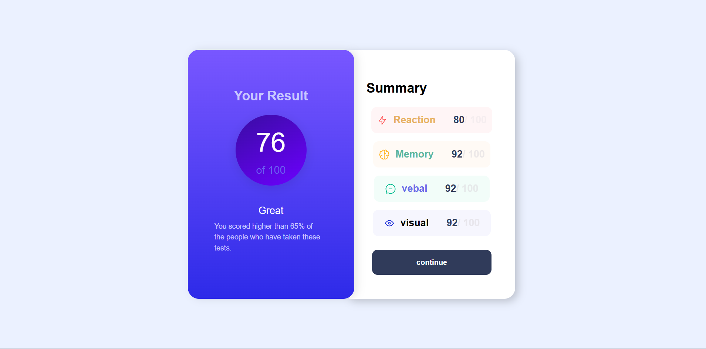

# Results Summary Component

This project is a frontend UI component that displays a summary of user test results. It is designed to be responsive and visually appealing, following a style guide for colors, typography, and layout.

## Features

- Displays user score out of 100 with a prominent result circle.
- Shows detailed scores for categories: Reaction, Memory, Verbal, and Visual.
- Responsive design supporting mobile (375px) and desktop (1440px) layouts.
- Styled with custom fonts and color schemes as per the style guide.
- Includes a "Continue" button for user interaction.

## Usage

Open the `index.html` file in a web browser to view the results summary component.

## Styling

The project uses the Hanken Grotesk font family with weights 500, 700, and 800. Colors and gradients follow the style guide defined in `style-guide.md`.

## Assets

Fonts and images are stored in the `assets` directory.

## Live Site

[View live site](https://result-summary-psi.vercel.app/)

## Author

Maxmillin
